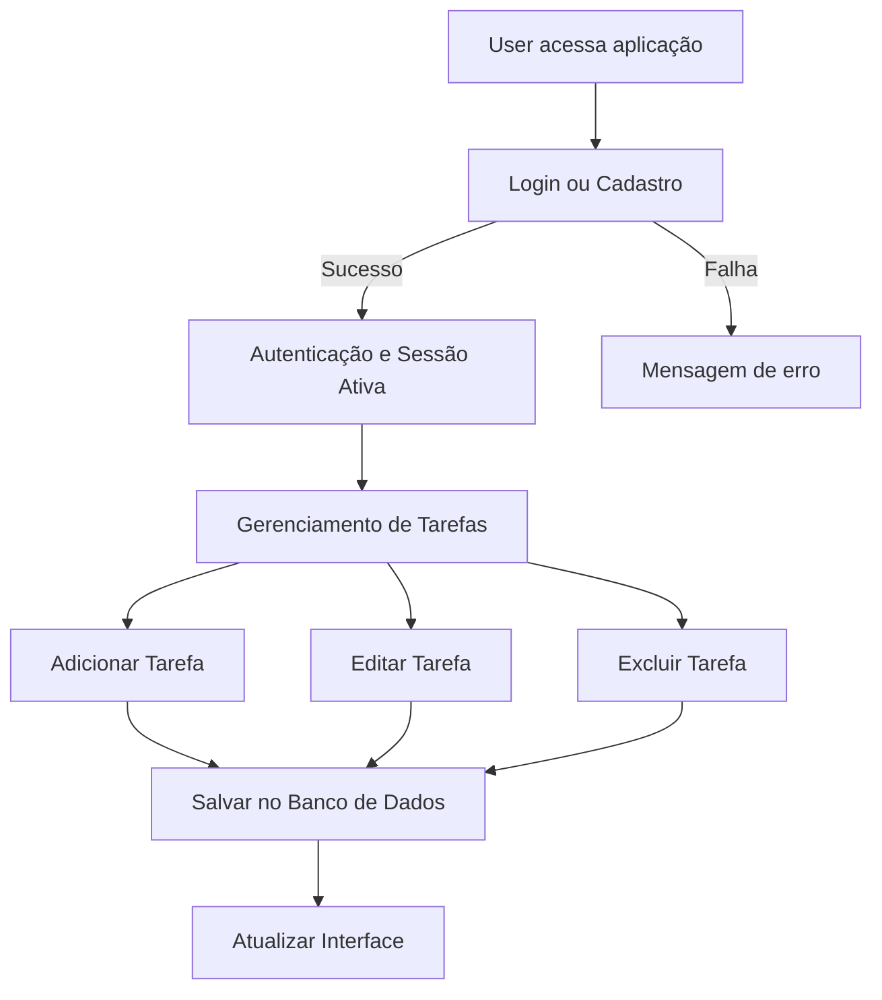

# Java-3-4Bimestres

## Sobre

Este é um projeto de **To-Do List** desenvolvido para ajudar usuários a organizar tarefas do dia a dia de forma simples e eficiente.

O trabalho foi feito como parte da disciplina **Laboratório de Programação 2 (LBP2)** no **IFSP**, com foco em:

* Back-end em **Java + Spring Boot**
* Front-end baseado em **SPA**
* Integração completa e funcional entre as camadas

---

## Equipe

| Nome Completo                  | Prontuário |
| ------------------------------ | ---------- |
| Bruno Timóteo Silva            | SP3116042  |
| Fernando Pereira Filipe Duarte | SP311872X  |
| João Pedro de Almeida Martins  | SP3115933  |
| Kaio Damasceno de Oliveira     | SP3124517  |
| Matheus Barbosa Silva          | SP311659X  |

---

## Como Executar o Projeto

### Pré-requisitos

* **Java JDK 17**
* **Maven**
* **Git**
* Uma IDE como IntelliJ, VS Code (com extensões Java) ou Eclipse

### Passos de Instalação

```bash
# Clone o repositório
git clone https://github.com/KaioDamasceno/Java-3-4Bimestres.git
cd Java-3-4Bimestres
```

1. Abra o projeto na sua IDE.

   * O `pom.xml` deve ser reconhecido automaticamente, baixando as dependências do Maven.
   * Caso isso não aconteça, use a opção **Reload Maven Project**.

2. Configure o **JDK 17** no projeto.

   * Caminho: `File > Project Structure... > Project SDK`.

3. Execute a aplicação:

   * Localize a classe principal:

     ```
     src/main/java/com/Projeto_3_4bim/todolist/JavaTodolistApplication.java
     ```
   * Clique com o botão direito e selecione **Run**.

4. Acesse no navegador:

   ```
   http://localhost:8080
   ```

---

## Banco de Dados

* Banco utilizado: **SQLite**
* O arquivo `todolist.db` é criado automaticamente na primeira execução.
* Para visualizar os dados, pode-se usar o [DB Browser for SQLite](https://sqlitebrowser.org/).

---

## Tecnologias Utilizadas (3º Bimestre)

* **Back-end**: Java 17, Spring Boot, Spring Security, Spring Data JPA/Hibernate
* **Front-end**: Thymeleaf, HTML5, CSS3 (Bootstrap 5)
* **Banco de Dados**: SQLite
* **Ferramentas**: Git, GitHub, Maven

---

## Fluxo esperado Projeto


